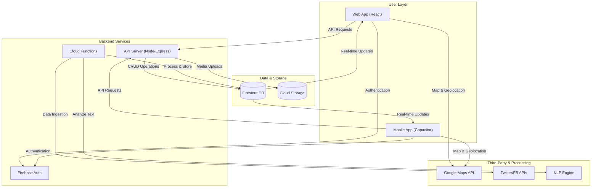
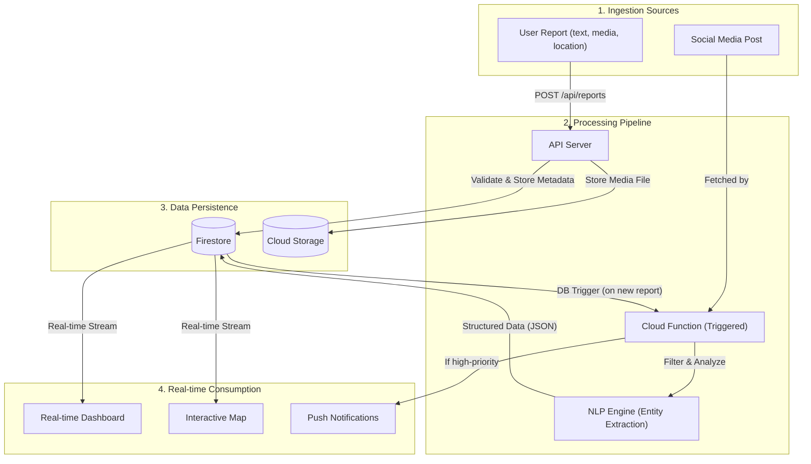
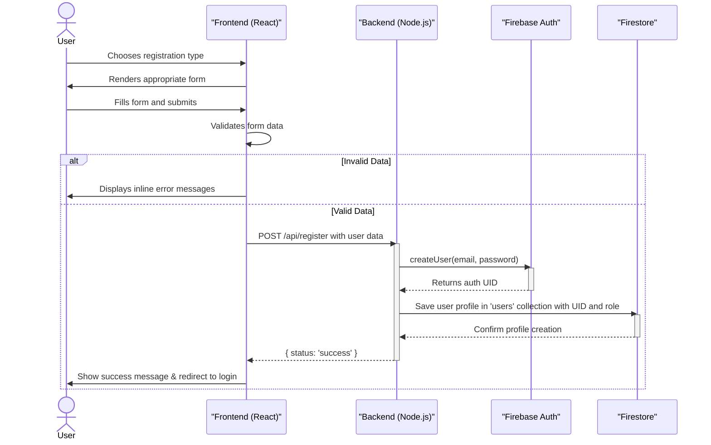
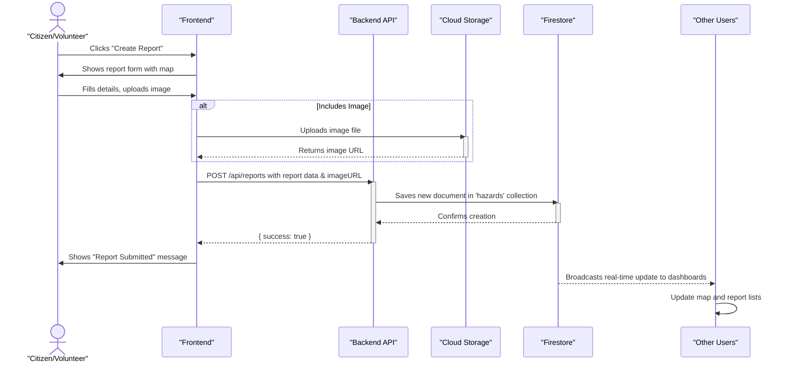
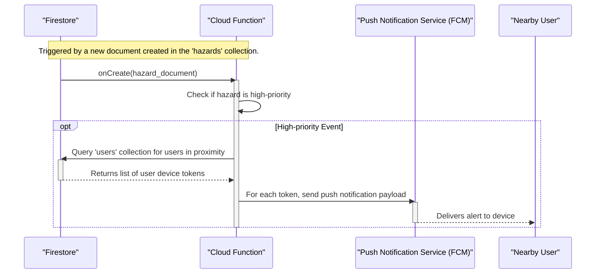

> **Note:** This document contains diagrams created using the [Mermaid](https://mermaid-js.github.io/mermaid/#/) syntax. To view them, please use a Markdown previewer with Mermaid support. For Visual Studio Code, it is recommended to install the [Markdown Preview Mermaid Support](https://marketplace.visualstudio.com/items?itemName=bierner.markdown-mermaid) extension.

# Project Overview: Tarang Ocean Hazards Monitoring System

This document provides a comprehensive overview of the Tarang Ocean Hazards Monitoring System, including its architecture, technology stack, data flow, and key workflows.

## 1. System Architecture

The system is designed as a scalable, real-time platform that leverages modern cloud technologies to provide a responsive and reliable user experience.

## 2. Tech Stack

*   **Frontend:** React (for web), Capacitor/React (for mobile)
*   **Backend:** Node.js, Express.js
*   **Database:** Firestore (Real-time NoSQL)
*   **Authentication:** Firebase Authentication
*   **Serverless Functions:** Firebase Cloud Functions
*   **Storage:** Cloud Storage for Firebase
*   **Geolocation & Maps:** Google Maps API
*   **Deployment:** Vercel (for web)

## 3. Data Flow

The data flow is designed to be real-time and event-driven, ensuring that information is processed and disseminated as quickly as possible.

## 4. Workflows

### User Registration Workflow

This diagram shows how a new user (either a citizen or a volunteer) is registered in the system.

### Hazard Reporting Workflow

This workflow outlines how a user submits a new hazard report.

### Alert Notification Workflow

This diagram shows how the system automatically sends alerts for high-priority events.

