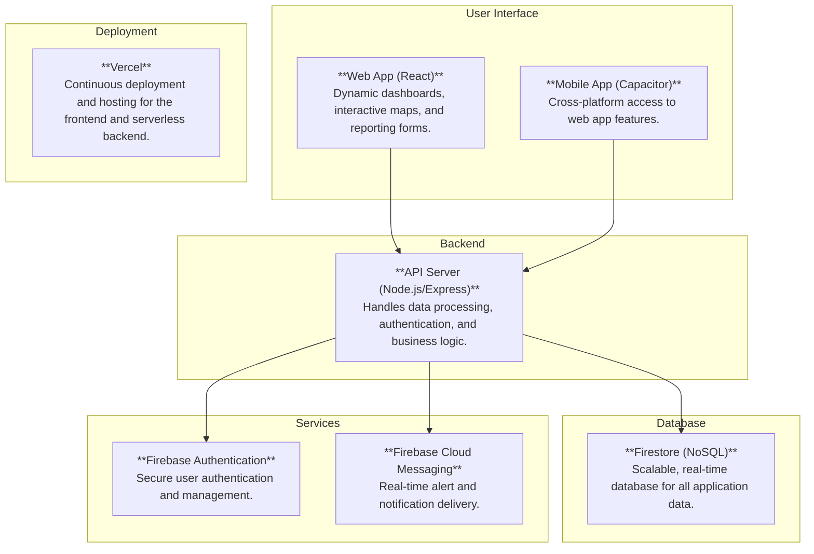

# Technology Stack

```mermaid
graph TD
    subgraph "User Interface"
        WebApp["**Web App (React)**<br>Dynamic dashboards, interactive maps, and reporting forms."]
        MobileApp["**Mobile App (Capacitor)**<br>Cross-platform access to web app features."]
    end

    subgraph "Backend"
        APIServer["**API Server (Node.js/Express)**<br>Handles data processing, authentication, and business logic."]
    end

    subgraph "Database"
        DB["**Firestore (NoSQL)**<br>Scalable, real-time database for all application data."]
    end

    subgraph "Services"
        Auth["**Firebase Authentication**<br>Secure user authentication and management."]
        FCM["**Firebase Cloud Messaging**<br>Real-time alert and notification delivery."]
    end

    subgraph "Deployment"
        Hosting["**Vercel**<br>Continuous deployment and hosting for the frontend and serverless backend."]
    end

    WebApp --> APIServer
    MobileApp --> APIServer
    APIServer --> DB
    APIServer --> Auth
    APIServer --> FCM
```
